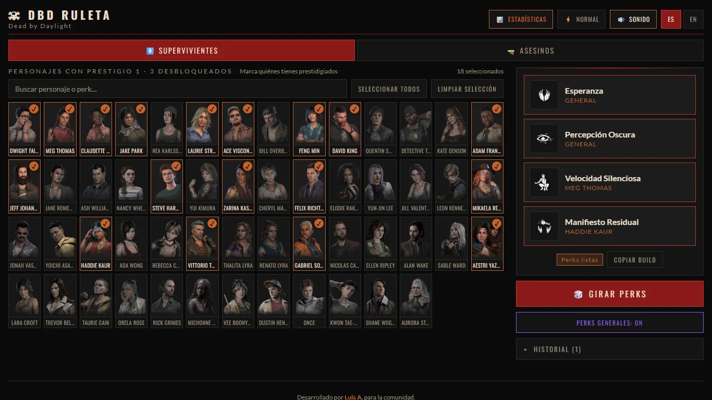
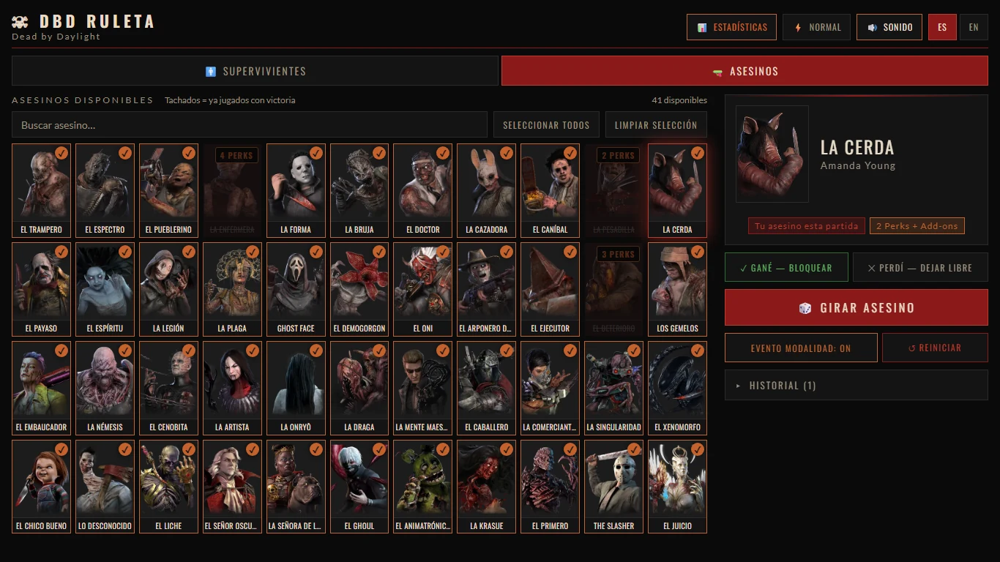

# DBD Ruleta · DBD Roulette

[Español](#español) · [English](#english)

**Jugar / Play:** https://luisnajm26-creator.github.io/DBD-Roulette/
&nbsp;·&nbsp; **Descargar para usar sin internet / Offline download:** [Releases](https://github.com/luisnajm26-creator/DBD-Roulette/releases/latest)





---

## Español

Ruleta no oficial para *Dead by Daylight*: sortea **perks de supervivientes** y **asesinos** (con modalidad de perks y add-ons). Es una sola página web, sin instalación ni cuentas, y funciona sin internet.

### Qué hace

- **Supervivientes:** marca los personajes que tienes con prestigio y la ruleta sortea 4 perks de entre las suyas (y, si quieres, de 14 perks generales).
  - Salen 4 perks el 80 % de las veces, 3 el 15 % y 2 el 5 %; las ranuras sobrantes quedan vacías.
  - Las perks de escape pesan el doble, y las que menos han salido en tus estadísticas son más probables.
  - Evita repetir las perks de la tirada anterior cuando hay suficientes para elegir.
- **Asesinos:** elige entre los asesinos disponibles. Si ganas la partida, lo bloqueas hasta reiniciar; si pierdes, sigue libre.
  - Con "Evento Modalidad" se sortea cuántas perks puedes usar: 4 (45 %), 3 (25 %), 2 (15 %), 1 (10 %) o 0 (5 %).
- **Estadísticas** de qué perks y modalidades han salido, con buscador.
- **Historial** de tiradas y botón **Copiar build**.
- **Buscador** de personajes por nombre o por perk, español e inglés, sin importar acentos.
- Botones de **silencio** y de **animación rápida**; se usa con teclado (Tab, Enter, Espacio, Esc).
- Toda la lista de personajes cabe en pantalla sin hacer scroll: la cuadrícula se ajusta sola al tamaño de tu ventana.

Incluye 54 supervivientes, 44 asesinos y 176 perks. Si el juego añade contenido nuevo y falta, abre un issue.

### Cómo usarla

- **En línea:** abre el link de arriba.
- **Sin internet:** descarga el `.zip` de [Releases](https://github.com/luisnajm26-creator/DBD-Roulette/releases/latest), descomprímelo y abre `index.html` con doble clic. Sin internet usa las fuentes del sistema en lugar de Oswald y Lato.
- **Tus datos** (personajes elegidos, estadísticas, historial, idioma) se guardan en el navegador, por dirección: lo que guardes en la web no aparece en la copia local ni en otro navegador. Si borras los datos del sitio, se pierden.

### Para desarrollar

No hay paso de compilación: son archivos estáticos (`index.html`, `css/`, `js/`, `data/`, `img/`).

```bash
python -m http.server 8000      # sirve la carpeta en http://localhost:8000
python tools/make_thumbs.py     # regenera img/thumbs/ (requiere: pip install pillow)
python tools/stamp.py           # actualiza los ?v= de index.html tras cambiar CSS o JS
node tools/check.js             # revisa codificación, imágenes, ids y traducciones
```

Antes de publicar cambios en CSS o JS ejecuta `stamp.py` y luego `check.js`: sin el sello, GitHub Pages puede servir copias viejas hasta 10 minutos.

**Agregar un personaje o asesino:** edita `data/survivors.js` o `data/killers.js` y añade las imágenes.

| Qué | Dónde va la imagen |
|---|---|
| Superviviente | `img/survivors/<nombre en inglés, solo a-z y 0-9>.webp` (por ejemplo `dwightfairfield.webp`) |
| Asesino | la ruta del campo `img`, por ejemplo `img/killers/trapper.webp` |
| Icono de perk | `img/perks/<nombre de la perk en inglés, solo a-z y 0-9>.webp` |

Después ejecuta `make_thumbs.py`, `stamp.py` y `check.js`.

### Aviso legal

Proyecto de fans, sin fines de lucro y **no afiliado** a Behaviour Interactive. *Dead by Daylight* y sus personajes, perks e imágenes son marcas registradas y propiedad de Behaviour Interactive Inc.; esas imágenes **no** están cubiertas por la licencia de este repositorio. Si eres titular de derechos y quieres que se retire algo, abre un issue.

El código se publica bajo la [licencia MIT](LICENSE).

---

## English

An unofficial roulette for *Dead by Daylight* that picks **survivor perks** and **killers** (with a perk/add-on restriction). It is a single static web page: no install, no accounts, and it works offline.

### What it does

- **Survivors:** tick the characters you have prestiged and the wheel picks 4 perks from theirs (and optionally from 14 general perks).
  - You get 4 perks 80% of the time, 3 perks 15% and 2 perks 5%; the remaining slots stay empty.
  - Escape perks count double, and perks that have come up less in your stats are more likely.
  - It avoids repeating the previous spin's perks when there are enough to choose from.
- **Killers:** pick from the available killers. Win the match to lock that killer until you reset; lose and it stays available.
  - With "Mod Event" on, it rolls how many perks you may use: 4 (45%), 3 (25%), 2 (15%), 1 (10%) or 0 (5%).
- **Stats** of which perks and modes have come up, with search.
- **History** of spins and a **Copy build** button.
- **Search** characters by name or by perk, in Spanish or English, accent-insensitive.
- **Mute** and **fast animation** buttons; keyboard friendly (Tab, Enter, Space, Esc).
- The whole roster fits on screen without scrolling: the grid sizes itself to your window.

It ships with 54 survivors, 44 killers and 176 perks. If the game adds content that is missing, open an issue.

### How to use it

- **Online:** open the link above.
- **Offline:** download the `.zip` from [Releases](https://github.com/luisnajm26-creator/DBD-Roulette/releases/latest), unzip it and double-click `index.html`. Offline it falls back to system fonts instead of Oswald and Lato.
- **Your data** (selected characters, stats, history, language) is stored in your browser, per address: what you save on the website does not show up in the local copy or in another browser. Clearing site data erases it.

### Development

There is no build step: it is plain static files (`index.html`, `css/`, `js/`, `data/`, `img/`).

```bash
python -m http.server 8000      # serves the folder at http://localhost:8000
python tools/make_thumbs.py     # regenerates img/thumbs/ (needs: pip install pillow)
python tools/stamp.py           # refreshes the ?v= links in index.html after CSS/JS changes
node tools/check.js             # checks encoding, images, ids and translations
```

Before publishing CSS or JS changes run `stamp.py` and then `check.js`: without the stamp, GitHub Pages can serve stale copies for up to 10 minutes.

**Adding a character or killer:** edit `data/survivors.js` or `data/killers.js` and add the images.

| What | Where the image goes |
|---|---|
| Survivor | `img/survivors/<English name, only a-z and 0-9>.webp` (for example `dwightfairfield.webp`) |
| Killer | the path in its `img` field, for example `img/killers/trapper.webp` |
| Perk icon | `img/perks/<English perk name, only a-z and 0-9>.webp` |

Then run `make_thumbs.py`, `stamp.py` and `check.js`.

### Legal

A non-profit fan project, **not affiliated** with Behaviour Interactive. *Dead by Daylight* and its characters, perks and images are trademarks and property of Behaviour Interactive Inc.; those images are **not** covered by this repository's license. If you are a rights holder and want something removed, please open an issue.

The code is released under the [MIT license](LICENSE).
